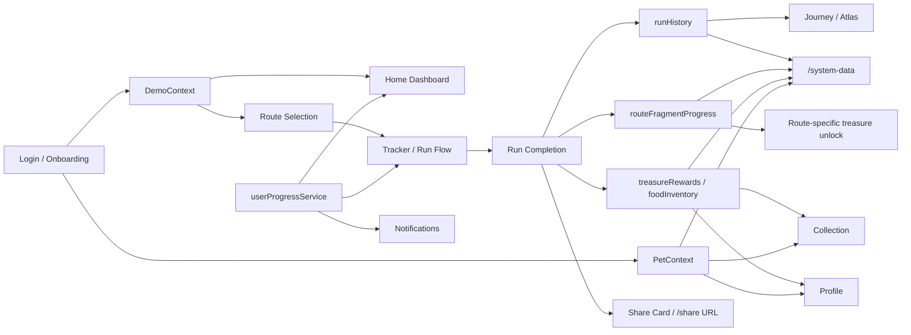

# ZenRun

ZenRun is a mobile-first, human-centred running web app prototype that combines running, cultural exploration, companion pets, rewards, and progress tracking. It is designed for coursework submission as a live, interactive system that demonstrates how playful companionship and reward-based storytelling can make casual running feel more emotionally engaging.

## Submission Links

- Live URL: To be added after deployment.
- Repository URL: To be added after GitHub upload.
- Recommended device: mobile viewport, such as iPhone 12/13/14 size.
- Data evidence page: `/system-data`
- Detailed marker guide: [docs/MARKER_GUIDE.md](docs/MARKER_GUIDE.md)
- Data handling documentation: [docs/DATA_HANDLING.md](docs/DATA_HANDLING.md)
- Architecture diagram: [docs/ARCHITECTURE.md](docs/ARCHITECTURE.md)
- AI usage logs: [ai-logs](ai-logs)

## Human-Centred Challenge

Many running apps focus mainly on performance data, which can feel repetitive or intimidating for casual users. ZenRun explores how playful companionship, cultural routes, and reward-based storytelling can make running feel emotionally rewarding, sustainable, and easier to return to.

The prototype asks: how might a running app encourage casual users through companionship, cultural discovery, and visible progress rather than only pace, speed, and competition?

## Core Feature Set

- Login and onboarding flow
- Companion pet selection
- Weekly running plan on the dashboard
- Route selection for historical, modern, and campus test routes
- Tracker flow with GPS / controlled-location support
- Landmark popups, companion voice narration, and persistent mood music
- Post-run completion summary
- Route-specific post-run share cards with shareable result links
- Food, treasure fragment, and treasure reward system
- Companion mood, energy, feeding, and equipment states
- Atlas postcard unlock system linked to completed routes
- Collection page for earned cultural relic treasures and food
- Rankings and insights pages for progress feedback
- Read-only `/system-data` page for data handling evidence

## Recommended Demo Flow

Use a mobile-sized browser viewport and follow this path:

1. Login
2. Complete onboarding and choose a companion
3. Open Home and review the weekly plan
4. Tap the Companion card to view the daily pet reminder
5. Select a route
6. Enter Tracker and start the run
7. Trigger or simulate route progress
8. Complete the run
9. View the completion summary and reward result
10. Open Journey / Atlas to confirm postcard progress
11. Open Collection to confirm rewards
12. Open Profile to confirm companion, feeding, equipment, and notification states
13. Optional: open `/system-data` to inspect current stored prototype state

## Technical Stack

- React
- TypeScript
- Vite
- Tailwind CSS
- Motion / Framer Motion-style animation via `motion`
- Recharts
- React Router
- React Context
- Browser `localStorage`

## Data Handling and State Management

ZenRun uses React Context and browser `localStorage` as a lightweight front-end data layer. This is suitable for a high-fidelity prototype because it keeps the app interactive and persistent across refreshes without requiring a production backend.

### How ZenRun Works



`DemoContext` manages the main journey state:

- Username, onboarding status, selected companion, and preferred route type
- Current selected route and route metadata
- Tracker state and run completion state
- Run history
- Treasure rewards
- Current run fragments and route fragment progress

`PetContext` manages companion-related state:

- Equipped treasure
- Equipped treasure by pet type
- Food inventory and food inventory by type
- Pet vitality and affinity
- Feeding and equipment interactions

`userProgressService` manages supporting stored settings:

- Weekly goal
- Voice and mood music settings
- Notification history for feed and equipment events

Completed runs are stored in `runHistory`. Home uses this data for today's distance and the monthly check-in calendar. Route fragment progress is stored in `routeFragmentProgress`; historical treasures unlock only when all memory fragments for the same route are collected. Earned treasures are stored in `treasureRewards`. Journey / Atlas derives postcard unlock state and Atlas stats from completed route ids, while Collection, Profile, Home, Results, and Atlas respond to the same stored state.

Post-run share cards use route-specific public data and generate `/share` links with encoded result information. Share links use `VITE_PUBLIC_SITE_URL` when configured so deployed links do not point to `localhost`. The XJTLU test route uses the XJTLU library image at `/images/share/xjtlu-library.jpg`.

Mood music files are stored in `public/audio/music/` as `happy.mp3`, `calm.mp3`, and `sad.mp3`. The selected track loops during the Tracker flow and stops when the user turns it off or ends the run.

The five cultural relic treasures shown in Collection are:

- Mise Celadon Lotus Bowl
- Sword of King Fuchai of Wu
- Bronze Tripod He with Coiled Chi-dragon Handle
- Pearl Sarira Pagoda
- Fish-roe Green Olive-shaped Zun

For a more detailed explanation, see [docs/DATA_HANDLING.md](docs/DATA_HANDLING.md).

## Evidence Pages and Coursework Materials

The project includes submission evidence alongside the app:

- `/system-data`: read-only state preview showing selected pet, current route, weekly plan, run history, inventory, treasure fragments, Atlas unlocks, and localStorage keys.
- `docs/DATA_HANDLING.md`: explains how user input and interaction states are stored and reused across the app.
- `docs/ARCHITECTURE.md`: shows the current app, state, media, and reward data flow.
- `docs/MARKER_GUIDE.md`: gives a short testing script for markers.
- `ai-logs/`: contains representative prompts used for AI-assisted coding, UI refinement, debugging, and documentation.

The `/system-data` page is not an admin panel. It is only a transparent evidence page for marking.

## Local Setup

Prerequisite: Node.js

Install dependencies:

```bash
npm install
```

Start the development server:

```bash
npm run dev
```

Build for production:

```bash
npm run build
```

Preview the production build:

```bash
npm run preview
```

Run TypeScript checks:

```bash
npm run lint
```

## Deployment

Recommended deployment settings for Vercel or Netlify:

- Build command: `npm run build`
- Output directory: `dist`
- Project root: repository root
- Netlify SPA redirect: `public/_redirects` contains `/* /index.html 200`

This repository also includes `.github/workflows/deploy.yml` for GitHub Pages. After pushing to the `main` or `master` branch, GitHub Actions will install dependencies, run `npm run build`, upload `dist`, and deploy the site to Pages.

Post-run share links use the public site origin when it is configured. For local development, links may fall back to `localhost`. For deployment, set this public environment variable:

```bash
VITE_PUBLIC_SITE_URL=https://merry-biscuit-f63aa7.netlify.app
```

On Netlify, add it in Site settings -> Environment variables. For local testing with the deployed share origin, create `.env.local` with the same value. This URL is public and not a secret.

For GitHub Pages, this repository is configured with Vite `base: "/zenrun/"`, so the expected URL is:

```text
https://<your-github-username>.github.io/zenrun/
```

Public assets are resolved through `import.meta.env.BASE_URL` so images and audio still load under the `/zenrun/` subpath.

GitHub Pages direct subroute refreshes are supported by `public/404.html`, which redirects back into the single-page app before React Router handles the route.

## Demo Notes

- The Tracker map uses HTTPS GaoDe / Amap web tiles for more reliable access in mainland China.
- If live map tiles fail, the Tracker keeps a soft fallback map background so the demo flow can continue.
- Browser geolocation and landmark trigger calculations are kept separate from the visual tile layer for prototype stability.
- GPS permissions depend on the browser, device, HTTPS status, and current network. For stable marking, use the provided demo flow and controlled/test route behaviour where possible.
- ZenRun is a prototype, so run tracking may be simulated or simplified for demo stability.

## AI Usage Statement

AI tools were used for ideation, code assistance, UI refinement, debugging, reward logic support, map positioning refinement, and documentation support. The team reviewed, tested, and manually adjusted AI-assisted outputs before including them in the final prototype.

Representative AI development prompts are documented in the [ai-logs](ai-logs) folder. No private tokens, passwords, API keys, or sensitive account information are included.

## Group Members / Contributions

| Member | Role | Implementation | Design / Research | Evidence / Output |
| --- | --- | --- | --- | --- |
| Shiyu Wang | Project Management | Coordinated the project timeline, workflow, and team progress across the full process. | Developed key UI/UX directions for the portfolio and product concept. | Contributed to user research planning and interview preparation. |
| Yaqi Zhang | Frontend Development | Built and refined key frontend screens for the prototype. | Produced visual assets and polished the interface style. | Supported low-fi prototyping work. |
| Hongya Wen | Technical Architecture | Planned the system architecture and service relationships. | Connected technical planning with high-fidelity prototyping, testing needs, and later refinement decisions. | Supported backend and integration-related implementation thinking. |
| Chengyuan Shi | Data Analysis | Collected and organized evaluation and questionnaire data. | Prepared cultural content used in routes and cards. | Helped document user-testing findings for the portfolio. |

## Known Limitations

- ZenRun is a high-fidelity prototype, not a production fitness platform.
- `localStorage` is used instead of a real backend database.
- GPS and run tracking may be simulated or simplified for demo stability.
- The map provider may be network-dependent.
- Some feeding and equipment history is represented through current state and notification records rather than a full backend event log.
- Future work could include backend accounts, real geolocation tracking, cloud sync, richer accessibility testing, and persistent multi-device progress.
