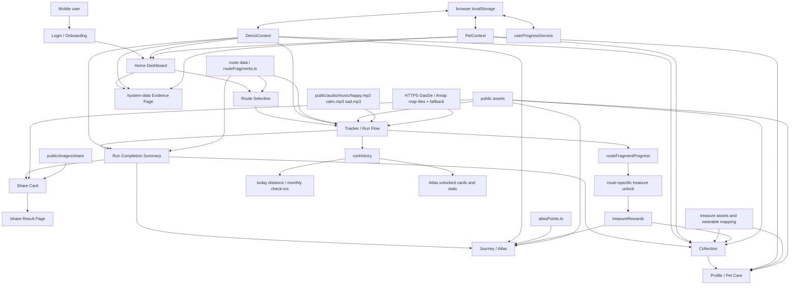

# ZenRun Architecture

This diagram summarizes the final front-end prototype architecture used for coursework submission.

Key data flow:

- Route selection writes the active route into `DemoContext`.
- Tracker completion writes a completed run into `runHistory`.
- `runHistory` drives dashboard distance, monthly check-ins, Atlas unlocks, and share result data.
- Route-specific memory fragments are stored in `routeFragmentProgress[routeId]`.
- A historical treasure is claimed only after all fragments for that route are collected.
- Collection and Profile merge earned and equipped treasure state by stable treasure ids.
- Share links encode public run summary data and use `VITE_PUBLIC_SITE_URL` when configured.
